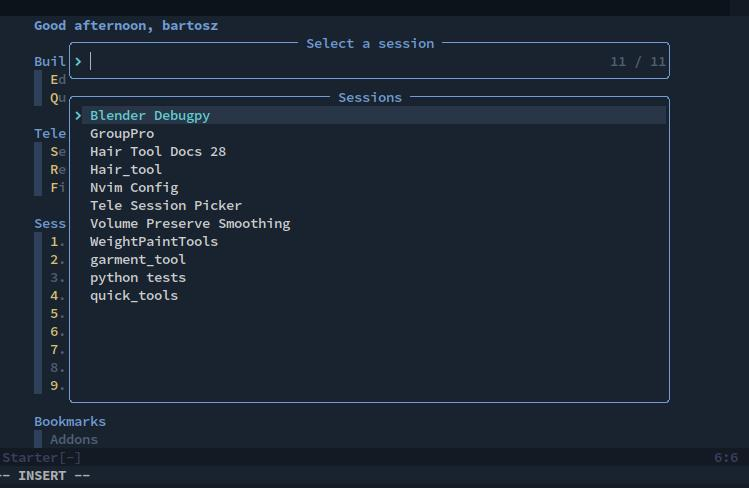

# Telescope Sessions loader
Load nvim session files from target directory



## Install
use 'JoseConseco/telescope_sessions_picker.nvim'

```
## Setup

``` lua
require('telescope').load_extension('sessions_picker')

```

## Configuration
This extension can be configured using `extensions` field inside Telescope
setup function.

```lua
require'telescope'.setup {
  extensions = {
    sessions_picker = {
      sessions_dir = vim.fn.stdpath('data') ..'/session/',  -- same as '/home/user/.local/share/nvim/session'
    }
  },
}
```

## Available commands
```viml
:Telescope sessions_picker

"Using lua function
lua require('telescope').extensions.sessions_picker.sessions_picker()
```


